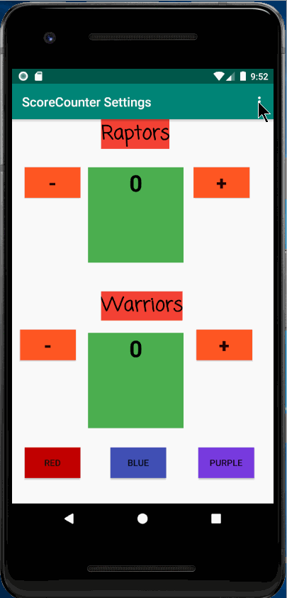

# Score-Counter

User can have preferences to their team, award they get when win, and favorite sport.
Two teams try to get to 5 points first, can change the background color of the score. 
When a team wins, it sends to a new screen, which allows the user to send a message/call someone and search for basketball courts nearby.

